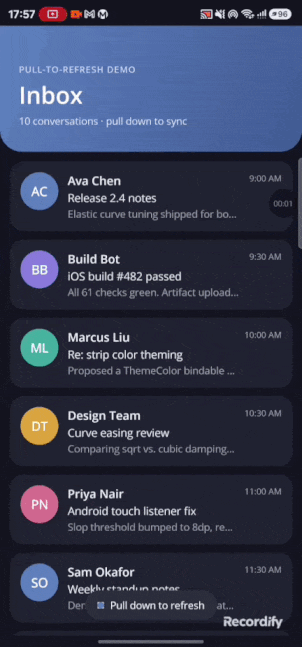

# Plugin.Maui.PullToRefresh

A pull-to-refresh control for .NET MAUI with a **native, elastic curved-strip
animation** that tracks the finger 1:1 — no spinner, no `RefreshView` wrapper,
no janky snap-back. Pull down, a colored strip stretches from behind the
content with a soft elastic curve, follows your finger's X position, and
either snaps back or triggers a refresh depending on how far you pulled.



## Why this exists

MAUI's built-in `RefreshView` gives you a platform spinner. Every third-party
pull-to-refresh control for MAUI (and most other frameworks) is a variation on
the same spinner-and-arrow idea. This one isn't: it's a physically-damped
curved strip, drawn natively (`CAShapeLayer` on iOS, `Canvas`/`Path` on
Android — no `GraphicsView`), that grows with `sqrt(pullDistance)` so it feels
elastic instead of linear, and whose peak follows the horizontal position of
the finger doing the pulling.

It was built for a real app's timesheet/absence lists and is being extracted
here as a standalone, reusable control.

## How it works

- **Gesture detection** happens at the platform layer, not through a MAUI
  `PanGestureRecognizer`: a `UIPanGestureRecognizer` on iOS, a raw
  `IOnTouchListener` on Android. Both look for "at the top of the scrollable
  content and moving down past a small slop" before treating the touch as a
  pull, so normal scrolling is never intercepted.
- **The scrollable content is auto-discovered.** `PullToRefreshViewHandler`
  walks the native view tree under whatever you put inside
  `PullToRefreshView` looking for a `UIScrollView` (iOS) or a
  `RecyclerView`/`NestedScrollView` (Android) — so it works with
  `CollectionView` and `ScrollView` without any extra wiring.
- **The curve is damped, not linear:** strip height is
  `min(sqrt(pullDistance) * 5.5, maxHeight)`, which is what gives the
  "stretchy" feel instead of a strip that grows 1:1 with the finger.
- **The curve tip follows the finger's X position**, clamped to the middle
  60% of the width so the Bézier control points never invert.
- Crossing the trigger threshold (72dp/pt) and releasing fires `Command` and
  the `Refreshing` event; releasing before that just animates the strip back
  to nothing.

Both platforms are independent implementations of the same math and gesture
state machine — there's no shared native code, just a shared MAUI-facing
`PullToRefreshView` control and `PullToRefreshViewHandler` partial class.

## Project structure

```
src/Plugin.Maui.PullToRefresh/     the library (net10.0-android, net10.0-ios)
  PullToRefreshView.cs             the public ContentView subclass (Command, IsRefreshing, Refreshing)
  Handlers/
    PullToRefreshViewHandler.cs    shared partial: property mapper + ctor
  Platforms/
    iOS/Handlers/                  UIPanGestureRecognizer + CAShapeLayer curve
    Android/Handlers/              touch listener + Canvas/Path curve

example/Plugin.Maui.PullToRefresh.Example/   a runnable MAUI app demonstrating usage
```

## Install

Not yet published to NuGet. Until then, reference the project directly:

```xml
<ProjectReference Include="..\Plugin.Maui.PullToRefresh\src\Plugin.Maui.PullToRefresh\Plugin.Maui.PullToRefresh.csproj" />
```

## Setup

Register the handler in `MauiProgram.cs`:

```csharp
using Plugin.Maui.PullToRefresh.Handlers;

builder
    .UseMauiApp<App>()
    .ConfigureMauiHandlers(handlers =>
    {
        handlers.AddHandler<PullToRefreshView, PullToRefreshViewHandler>();
    });
```

## Usage

Wrap any scrollable content — a `CollectionView` or `ScrollView` — in
`PullToRefreshView` and bind `Command` to whatever refreshes your data:

```xml
<ContentPage
    xmlns="http://schemas.microsoft.com/dotnet/2021/maui"
    xmlns:ptr="clr-namespace:Plugin.Maui.PullToRefresh;assembly=Plugin.Maui.PullToRefresh">

    <ptr:PullToRefreshView Command="{Binding RefreshCommand}">
        <CollectionView ItemsSource="{Binding Items}" />
    </ptr:PullToRefreshView>

</ContentPage>
```

`PullToRefreshView` also exposes a `Refreshing` event as an alternative to
binding `Command`, and an `IsRefreshing` bindable property reserved for host
pages that want to track state explicitly (the handler itself doesn't read or
write it — it just fires `Command`/`Refreshing` and lets you decide when the
operation is done).

See `example/Plugin.Maui.PullToRefresh.Example` for a full working sample.

## Platform support

| Platform | Status |
|---|---|
| Android | ✅ |
| iOS | ✅ |
| Mac Catalyst | ❌ not implemented yet |
| Windows | ❌ not implemented yet |

## Building the example

```bash
cd example/Plugin.Maui.PullToRefresh.Example
dotnet build -f net10.0-android   # or -f net10.0-ios
```

## License

MIT — see [LICENSE](LICENSE).
